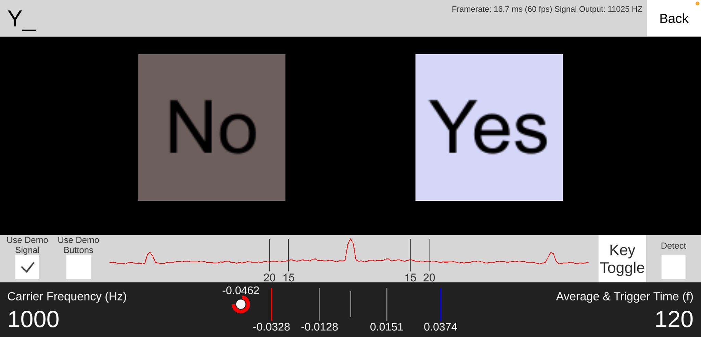
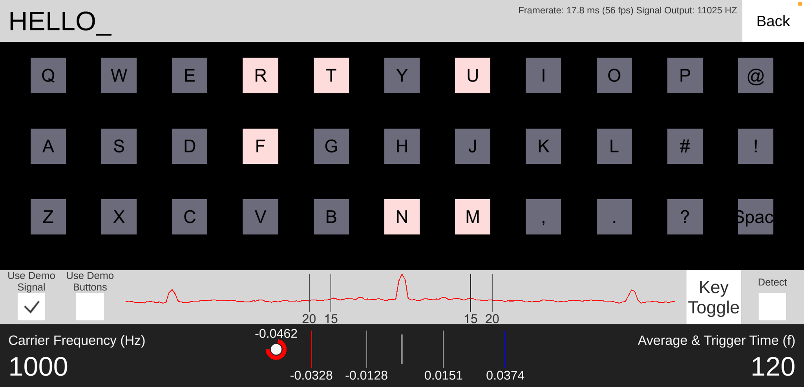

# SSVEP Keyboard

v0.18

This is a repository for the SSVEP keyboard built primarily for the icibici

[icibici](https://icibici.github.io/site/) is a hardware / software platform born with the intention of Developing an EEG under £20.

Other repositories that are a part of the icibici Project:

* [icibici on Github](https://github.com/icibici)
* [icibici Android diagnostic app](https://github.com/icibici/Android-diagnostic-app)
* [icibici hardware](https://github.com/icibici/smartphone-bci-hardware)

---------------------------------------------------------------------------------------------------------------------------------------------------------

**WARNING! THIS APP USES FLICKERING LIGHTS! DO NOT USE THIS APP IF YOU HAVE PHOTOSENSITIVE EPILEPSY**
---------------------------------------------------------------------------------------------------

---------------------------------------------------------------------------------------------------------------------------------------------------------

## What is SSVEP?

- [A Quick Intro to SSVEP](https://web.archive.org/web/20181209171157/http://synaptitude.me/blog/a-quick-intro-to-ssvep-steady-state-visually-evoked-potential/)

## The Unity App

The **SSVEP Keyboard** app is built in Unity (currently version 2020.1.6f1) and can run on following platforms:

- iOS
- Android
- Mac
- PC
- Linux
(The Mac, PC and Linux versions have a much lower signal resolution due to hardware limitations. They are also older builds but should have similar functionality. iOS and Android versions work better as lower sample rates can be used to acheive a higher signal resolution.)

**[Android/PC/Mac/Linux Download link](https://drive.google.com/drive/folders/0B4W4Pn0tIMBXbGUtdmJCMW02dk0?usp=sharing)**

**[iOS Download link](https://testflight.apple.com/join/QYT2bQc4)**
(For iOS you need to add yourself to the beta tester list using the link above)

### SSVEP Keyboard app

To use the app, it must be connected to the icibici hardware (see instructions [here](https://github.com/icibici/smartphone-bci-hardware))

- You can type on a keyboard using EEG signals from an icibici device
- Three keyboards! Y/N, 0-9, and English with next letter preditiction
- Scalable keyboard keys (pinch to scale)
- The app will output a carrier wave signal (1000 Hz default but 5000 Hz might be the best setting to reduce noise) tone via the headphone jack to act as a carrier wave for the icibici (if you don't have anything plugged in it will emit the tone from your built-in speakers. It's annoying but you'll know the tone is being sent out)
- The app will read a signal from the microphone and display a visual output of the frequecy bands +-60Hz from the carrier signal (default 940-1060 Hz). Touch this output to see a larger version of the graph.
- Red flashes at 15Hz, blue at 20Hz
- Frequency bands relating to the modulated 15Hz and 20Hz brain signals are highlighted. (Look for peaks at these points).
- Use demo signal toggle: Turn this on to play a pre-recorded EEG signal (from my own brain) instead of using the signal from your device. This will only work correctly when the carrier signal is set to 1000 Hz.
- Difference visualiser
  - The difference between the values of the peaks at 15Hz and 20Hz is displayed on the bottom of the screen.
  - The white dot displays the current difference.
  - A grey line in the middle shows the zero point.
  - The red and blue lines show the trigger levels for low and high frequency triggers. If the dot moves beyond these lines then trigger timer starts. These lines can be dragged to set the trigger levels based on the signal from different users in different situations.
  - The trigger timer is visualised by a red cicle around the white dot. When the circle is complete (and detect is on) it will trigger a keypress for the low or high frequency keys.
  - Average & Trigger Time: This is the time in frames (there should be 60 frames per second) that the white dot needs to be in the trigger region before it triggers a keypress. It's also the amount of frames used to average the signal. If you set it to 1 you will see the raw signal without averaging. 120 frames (2 seconds) is the default setting. A rolling average is used so instead of just dividing the samples into blocks a block of the last set amount of frames is averaged every single frame.
  - The two grey lines are reset lines. If the white dot moves past them towards the middle then the trigger timer is reset. These lines can also be repositioned.
- Detect toggle: Turn on to drive the keyboard with your signal using the trigger levels as described above.
- Use Demo Buttons: The keyboard can be operated manually by clicking the low frequecy and high frequecy buttons, this will simulate what would happen if the device had triggered a low or high frequency signal.
- Click Idle Reset to reset the input. As the input averages over time this will clear out old data and start fresh. This button is less useful now so you can probably just ignore it.
- Any keypresses will be entered in the output area at the top of the screen. Click this area to clear the output.

Important notes:
- The framerate needs to be 60 fps for it to work properly. (check this value in the top right corner of the screen)
- Make sure your phone volume is turned up to abut 80% (too high and it may not work at all, too low and there may be additional noise)

### Flicker app

This app does not do any signal processing. It simply just displays flashing squares as specific frequencies. It could be used for testing with other BCIs or with another phone running the SSVEP keyboard app.

- Display two squares that flicker at two different Hz rates set by the user.
- Be sure to choose frequencies that divide evenly into 60Hz for accurate flickers (15Hz and 20Hz are used in the keyboard)
- Note that the screen refresh rate (displayed in the app) should be 60fps for this to work correctly. (For example 30fps will not display 20Hz correctly as it does not divide evenly)

